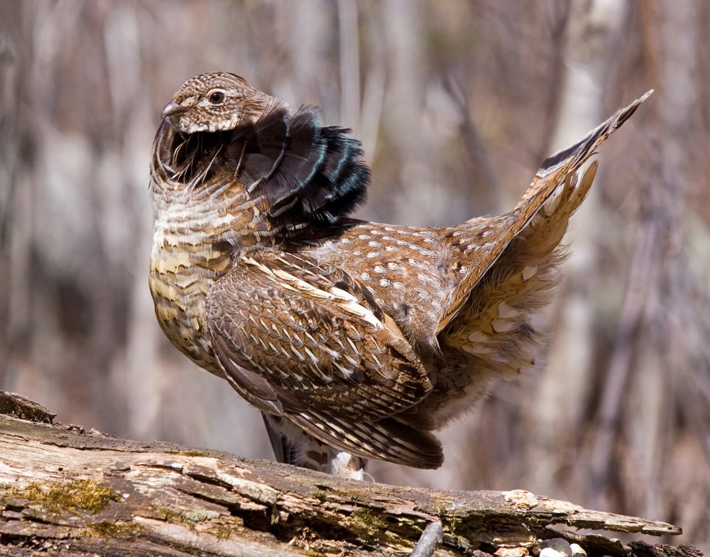
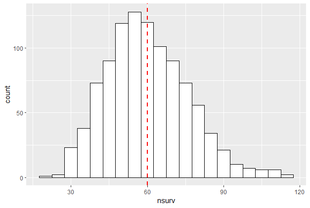
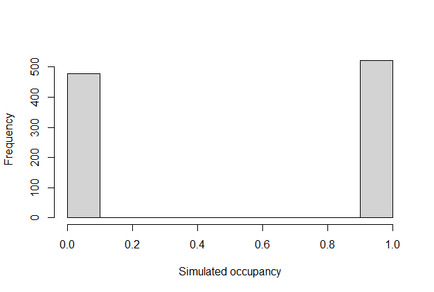
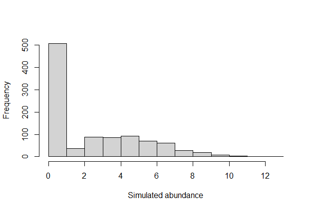
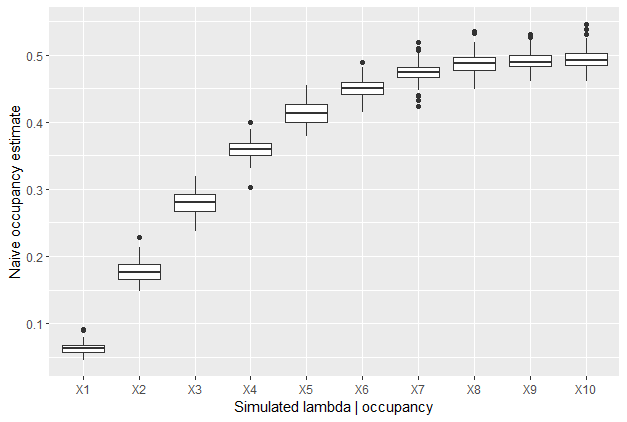

# Simulations linking Ruffed Grouse (*Bonasa umbellus*) occupancy data to abundance 

### *What does occupancy tell us?* 

 


## Andy Crosby 
### February 27, 2023  
<br />
### <a href="https://github.com/baynelab-research/rugr-population-estimate/tree/main/1_scripts/">Link to Simulation Code</a>


<br />

##### Image credit: David Brislance
---

# **Can we use occupancy data to infer abundance?** 

## What is the probability of detecting at last one drumming male, given the number of active drumming sites within the sampling radius? 

## **Some terms:** 

### **Active drumming site:** a location (usually a log) being used for drumming by a male grouse during the sampling season 

### **Intensity:** The percentage of grouse participating in drumming on a given day 

### **Rate** The length of time between drums for an individual grouse 

---

# **Objective** 

## Simulate detection data similar to that found in the Bayne Lab samples, conditional on: 

### **Ecological process of interest:** Abundance drumming sites

### **Detection process:** 

* Intensity of drumming 

* Rate of drumming 

## Initial simulations not spatially or temporally explicit 

---
# Simulating the Sampling Process 

```{r, eval=FALSE}

nsite = 1000 # The number of sites 

max.nsurv = 113 # The maximum number of surveys at a site 

# We simulated the number of surveys at each site according to a gamma distribution
# Parameters for the gamma distribution were derived from the actual data 
nsurv <- data.frame(nsurv = round(rgamma(n = nsite, shape = gam$parameters[1], scale = gam$parameters[2]), 0))
nsurv$nsurv[nsurv$nsurv > max.nsurv] <- max.nsurv

```




---
# Simulating the Ecological Process 

```{r, eval=FALSE}
psi = 0.5 # Occupancy rate derived from data 
lam = 5   # Rate parameter of Poisson distribution of abundance (initial value)

# Simulate occupancy and abundance conditinoal on occupancy 
occ <- rbinom(nsite, 1, psi)
abund <- rpois(nsite, lam)*occ

```

.pull-left[

] 

.pull-right[

]

---
# Simulating the Detection Process 

## Intensity and rate parameters derived from Guillon (1966; Journal of Wildlife Management) 
## Simulate the proportion of male grouse drumming on a given day
```{r, eval=FALSE}

intensity.mean <- mean(c(29,49,31,30))
intensity.sd <-  mean(11,18,20,14)

intensity <- function(x) {rnorm(1, mean.pct.active, sd.pct.active)} 

active.day <- sapply(1:max(nsurv), intensity)
active.day[active.day < 0] <- 0

```

## Finally, we used the drumming rate to simulate whether an active male grouse within the sampling area was drumming during a given 1-minute survey  

---

# **Results** 

## Simulations of Naive Occupancy Estiamtes given lamdbas from 1--10 


---
# **What it means so far**  

## Simple intial simulations 

## Explicitly links abundance to detection probability 

## Incoroporates drumming behaviour  

## Can vary other aspects of detection probability (i.e. intensity and drumming rate) 

## * Use values from the literature 

## * Get good estimates of uncertainty under different assumptions 


